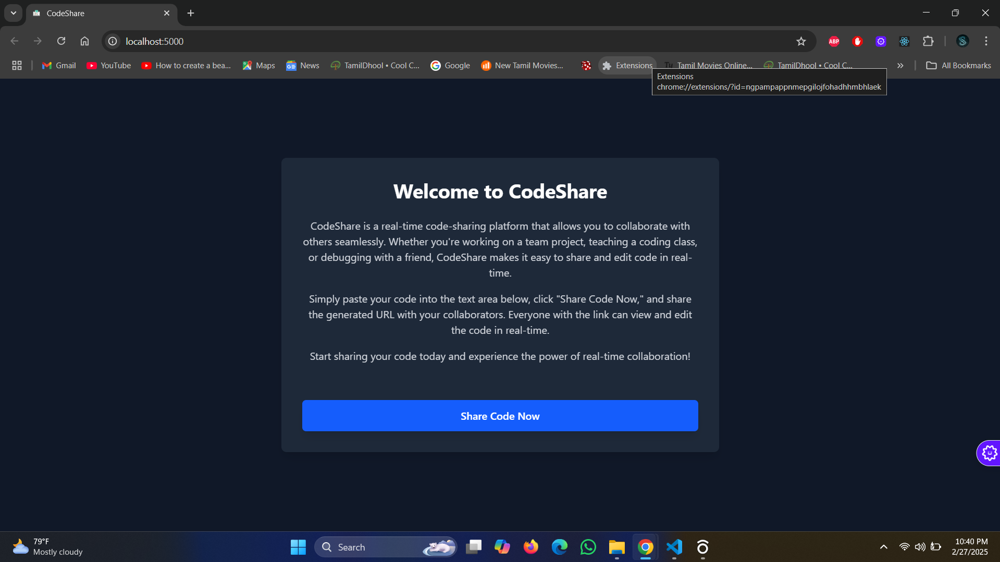
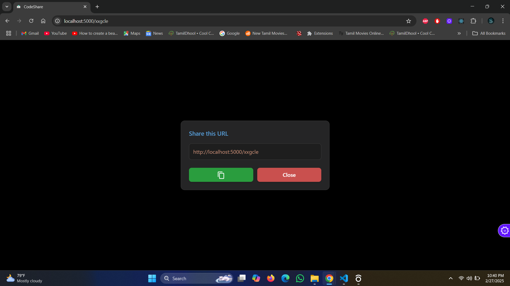
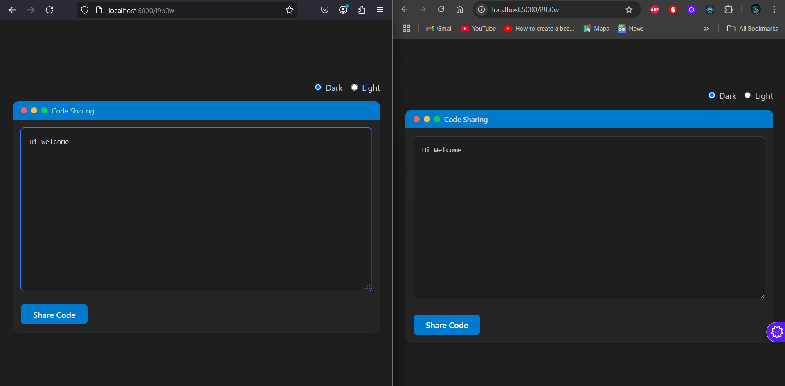

# CodeShare

CodeShare is a real-time code-sharing platform that allows users to share and collaborate on code in real time. This project leverages WebSockets for real-time collaboration and provides an easy-to-use interface for sharing and editing code with others.

## Features

- Share and edit code in real-time.
- Generate a unique link for each code session.
- Seamless collaboration with others.
- Light and dark themes for the editor.

## Screenshot

## Tech Stack

- **Frontend**: React, Vite, Tailwind CSS
- **Backend**: Node.js, Express, Socket.IO
- **Database**: Memory

